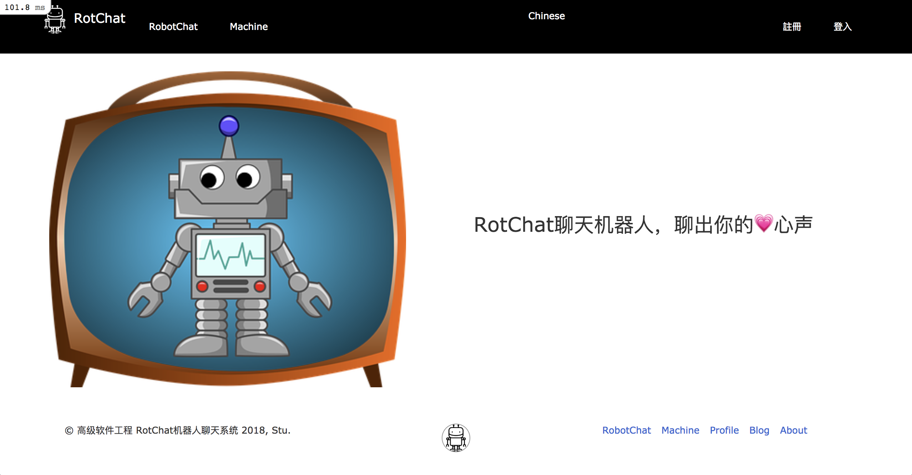
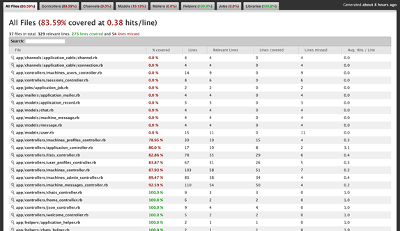

# README
聊天机器人的实现，调用了图灵机器人等三个接口
# 主页

# 版本选择
* 数据库：SQLite3
* Ruby：2.3.4
* Rails：5.2.1
* (具体见Gemfile文件)...

# 开发记录
* 2018 年12月5日 实现上传头像功能
* 未能实现ajax上传头像
* user.update('img_url':filename)，其中的冒号和前面的字符串之间不能有空格
* 2018年12月22日 添加注释和404页面的设置
* 尽量不要在html.erb页面中间加js代码，出现了一个页面加载不完全的bug是因为js写在html代码中间
* 编码问题：在远程调用的过程中url的编码经常会导致不成功。中文转URL：URI::escape(url)；response中的json转中文：response.body.encode("ASCII-8BIT").force_encoding("utf-8")
* URL的编码：
  require 'open-uri'
  puts URI::encode 'C#' #输出C%23
  puts URI::decode 'C%23' #输出C#
* 如何在controller指定页面跳转，如show方法我想跳转到除了指定位置的show.html.erb之外的其他页面我该如何处理?
* 2018年12月24日 子系统之间的互相调用，机器人系统调用博客系统的评论功能 https://github.com/FairyFali/Blog.git ，使用异常处理来屏幕blog的崩溃情况，不会对本系统造成影响。bug：blog的标题字段中文就不能插入数据库，而内容字段中文可以插入数据库，但是另一个数据库的修改插入中文都没有问题。
* benchmark性能测试，加入gem derailed_benchmark，命令：bundle exec derailed bundle:mem
* 尝试nginx部署，没有成功，报404错误。
* 数据库存储过程中的时区问题，加入以下几行代码：
  * 从ActiveRecord中取的时候是本地时间
    config.time_zone = "Beijing" 
  * 存入数据库的时间也是本地时区的时间
    config.active_record.default_timezone = :local 
  * 关闭以UTC格式存入数据库并读取以本地时区格式读取的功能（这行最主要）
    config.active_record.time_zone_aware_attributes = false 
* 设计模式，新增机器人api调用方法的情况。
* 页面添加css。

# TODO
* 测试没有完全弄明白。
* 发送邮件。
* I18N细化。

# 命令
* 运行命令：rails s -p 3000 -e production
* 测试命令：rails test -b test/models/article_test.rb
* 数据库迁移命令：rake db:schema:load

# I18N国际化
只是使用了它的一点点语言转化功能，没有使用太明白，为什么notice显示出来的行数有很多，对某些串没有转化成功。

# 测试覆盖率检测·
使用gem包simplecov，rake test后在项目目录下生成coverage目录文件，内部为测试覆盖率的报告。

# 使用分布式开发
自己的思考：使用HTTP调用的方式实现分布式开发，在机器人的内部增加一个blog_id字段，在blog系统增加一个机器人博客，相当于在blog博客系统创建一篇博客，用户可以在blog系统博客下留言，Rot系统可以接收评论并展示。

# 个人体会
Rails确实是敏捷开发，但是对于初学者来说学习成本是很高的，想要达到敏捷开发的水平是需要相当的经验。ddl是第一生产力。Ruby中总是忘记将数值型转化为字符串，因为java中的所有类型都可是使用""+a类似的方式转化为字符串。

# 推荐一些工作中用到过的好用的gem
* hirb:使得rails c下的数据输出结果更友好。
* simplecov:使用后会自动生成测试覆盖率报告。

